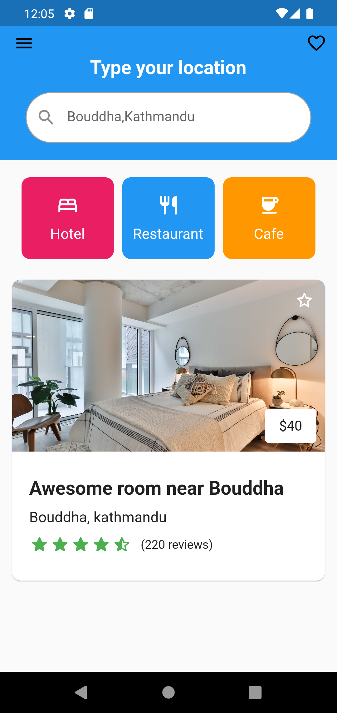

<table>
  <tr>
    <td align="center">Hotel UI</td>
    <td align="center">Farm UI</td>
    <td align="center">Ecommerce UI</td>
     </tr>
  <tr>
    <td align="center"></td>
    <td align="center"></td>
    <td align="center"></td>
   </tr>
</table>

 <table>
  <tr>
    <td align="center">Auth UI</td>
    <td align="center">Profile UI</td>
  </tr>
  </tr>
  <tr>
    <td align="center"></td>
    <td align="center"></td>
  </tr>
</table>

<table>
  <tr>
    <td align="center">Staggered Gridview</td>
    <td align="center">Blog Home UI</td>
    <td align="center">Contacts UI</td>
    <td align="center">Cards</td>
     </tr>
  <tr>
    <td align="center"></td>
    <td align="center"></td>
    <td align="center"></td>
    <td align="center"></td>
    </tr>
</table>
    

